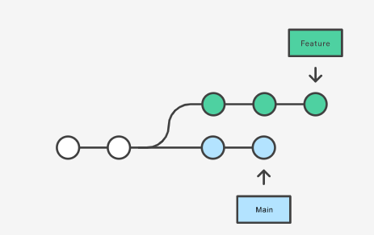
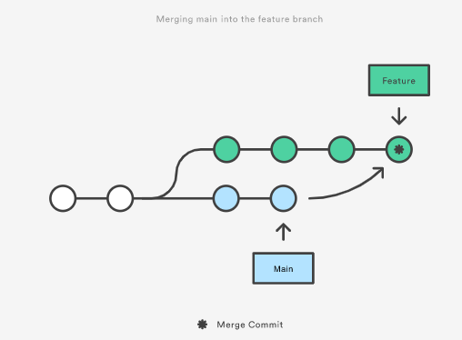

# Uma introdução ao Git e ao GitHub

Um tutorial passo a passo para o git e o GitHub.

<h3>Etapa 1. Crie o repositório</h3>

Inicialmente, o repositório que você criar no Bitbucket ficará vazio sem nenhum código nele. Tudo bem porque você começará a adicionar alguns arquivos a ele em breve. Este repositório Bitbucket será o repositório central para seus arquivos, o que significa que outras pessoas podem acessar esse repositório se você der permissão a eles. Depois de criar um repositório, você copiará uma versão para seu sistema local - dessa forma, você poderá atualizá-lo de um repositório e depois transferir essas alterações para o outro.

<h3>Etapa 2. Tutoriais avançados do Git</h3>

<h4>Merging vs. Rebasing</h4>
git mergee git rebasecomandos oferecem formas alternativas de integrar commits de diferentes branches, e ambas as opções vêm com suas próprias vantagens. Neste artigo, discutiremos como e quando uma git mergeoperação pode ser substituída por um rebase.

**Visão geral conceitual**
A primeira coisa a entender sobre **git rebase** que ele resolve o mesmo problema que **git merge**. Ambos os comandos são projetados para integrar as alterações de uma ramificação em outra ramificação - eles apenas fazem isso de maneiras muito diferentes.
Considere o que acontece quando você começa a trabalhar em um novo recurso em uma ramificação dedicada e, em seguida, outro membro da equipe atualiza o **main branch** com novos commits. Isso resulta em um histórico bifurcado, que deve ser familiar para qualquer pessoa que tenha usado o Git como uma ferramenta de colaboração.

Agora, digamos que os novos commits em *main* são relevantes para o recurso em que você está trabalhando. Para incorporar os novos commits em seu **feature branch**, você tem duas opções: mesclar ou rebase.

**A opção de merge.**

A opção mais fácil é o **merge** da branch main para a ramificação de feature usando algo como o seguinte:
>git checkout feature
>git merge main

Ou, você pode condensar isso em uma linha:
>git merge feature main

Isso cria um novo “commit de mesclagem” no featurebranch que une os históricos de ambas as ramificações, dando a você uma estrutura de ramificação parecida com esta:

Merge é bom porque é uma ação não destrutiva. As ramificações existentes não são alteradas de forma alguma. Isso evita todas as armadilhas potenciais do rebase (discutido abaixo).

Por outro lado, isso também significa que a feature branch terá um commit de merge estranho toda vez que você precisar incorporar mudanças upstream. Se main é muito ativo, isso pode poluir um pouco o histórico do seu branch de recursos. Embora seja possível mitigar esse problema com recursos avançados **git log** opções, pode dificultar a compreensão da história do projeto por outros desenvolvedores.
